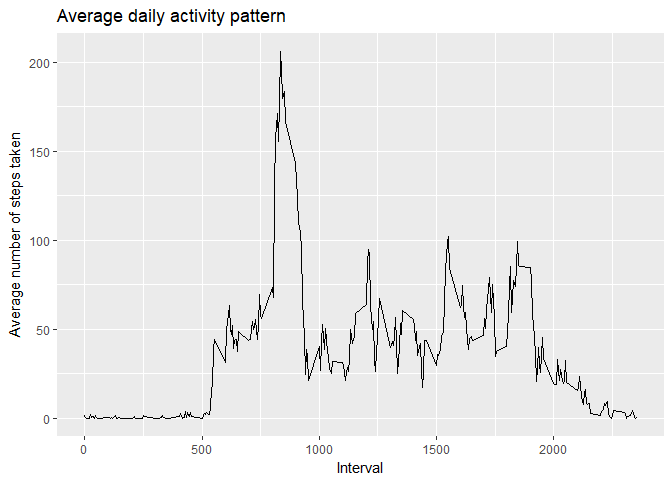

## Loading and preprocessing the data

*In this part We set the working directory and load the dataset and store it in a variable called Data*


```r
setwd("F:/Data Science Specialization/Course Five/Week Two/RepData_PeerAssessment1/activity")
Data<-read.csv("activity.csv")
```

## What is mean total number of steps taken per day?
*In this part we compute the total number of steps taken per day and make a histogram of it*

```r
library(dplyr)
```

```
## 
## Attaching package: 'dplyr'
```

```
## The following objects are masked from 'package:stats':
## 
##     filter, lag
```

```
## The following objects are masked from 'package:base':
## 
##     intersect, setdiff, setequal, union
```

```r
#removing days and intervals with steps input having missing values
DataFiltered<-filter(Data,!is.na(steps))
#grouping data and then summarizing the grouped data
DataGrouped<-group_by(DataFiltered,date)
DataSum<-summarize(DataGrouped,tot = sum(steps))
#Making the histogram of the total steps taken per day
hist(DataSum$tot,col="blue",main  = "Histogram of total steps taken per day",xlab = "Total Steps")
```

<!-- -->

```r
mean<-format(mean(DataSum$tot),digits = 7)
median<-median(DataSum$tot)
```
The mean of the steps taken per day is 10766.19 and the median is 10765.

## What is the average daily activity pattern?
*In this part we compute the average daily activity pattern*

```r
library(ggplot2)
#grouping data based on the 5-minute intervals and then summarizing the data
DataGrouped1<-group_by(DataFiltered,interval)
DataSum1<-summarize(DataGrouped1,average = mean(steps))
g<-ggplot(DataSum1,aes(x=interval,y=average))
g+geom_line()+labs(title="Average daily activity pattern")+labs(x="Interval",y="Average number of steps taken")
```

<!-- -->

```r
max<-DataSum1[DataSum1$average==max(DataSum1$average),1]
min<-max-5
```
The 830-835 interval contains the maximum number of steps on average.

## Imputing missing values
*In this part we deal with the missing values*

```r
#First, we compute the total number of missing values 
count<-sum(is.na(Data$steps))
#We use the mean for the 5-minute interval instead of missing values 
DataImputed<-Data
for (i in 1:length(Data$steps)) {
  if(is.na(DataImputed$steps[i]))
    DataImputed$steps[i]<-DataSum1[DataImputed$interval[i]==DataSum1$interval,2]
}
DataImputed$steps<-as.double(DataImputed$steps)
#grouping data and then summarizing the grouped data
DataGrouped2<-group_by(DataImputed,date)
DataSum2<-summarize(DataGrouped2,tot = sum(steps))
#Making the histogram of the total steps taken per day
hist(DataSum2$tot,col="blue",main  = "Histogram of total steps taken per day",xlab = "Total Steps")
```

<!-- -->

```r
mean1<-format(mean(DataSum2$tot),digits = 7)
median1<-format(median(DataSum2$tot),digits=7)
```
The total number of missing values is 2304.  

The mean of the steps taken per day is 10766.19 and the median is 10766.19.  

As we can see the total daily number of steps has increased because now, we have more data points but the estimates do not differ much from the first part of the assignment.  


## Are there differences in activity patterns between weekdays and weekends?
*In this part We find out whether or not there are any differences in activity patterns between weekdays and weekends*


```r
library(lattice)
DataImputed$date<-as.Date(DataImputed$date)
DataImputed1<-mutate(DataImputed,weekday = factor(weekdays(DataImputed$date)!="Sunday" & weekdays(DataImputed$date)!="Saturday",labels = c("weekend","weekday")))
DataGrouped3<-group_by(DataImputed1,weekday,interval)
DataSum3<-summarize(DataGrouped3,NumberOfSteps = mean(steps))
xyplot(NumberOfSteps~interval|weekday,data = DataSum3,layout=c(1,2),type="l")
```

<!-- -->
